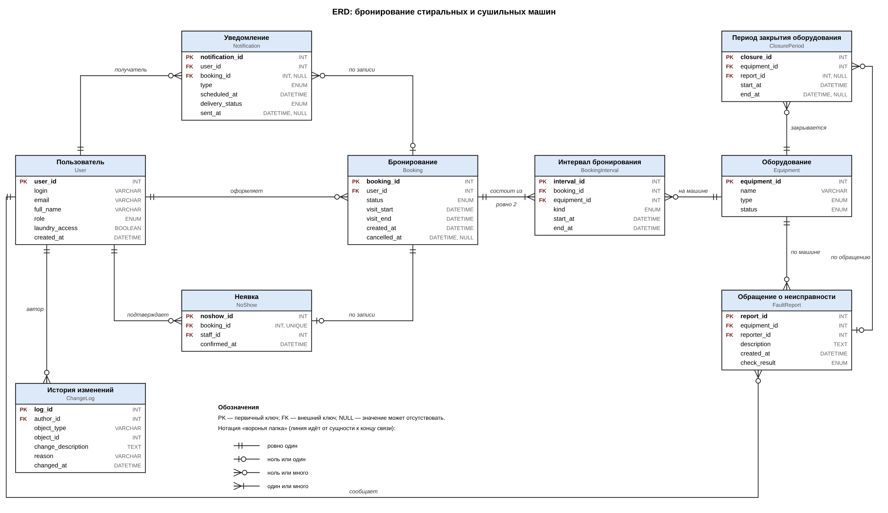
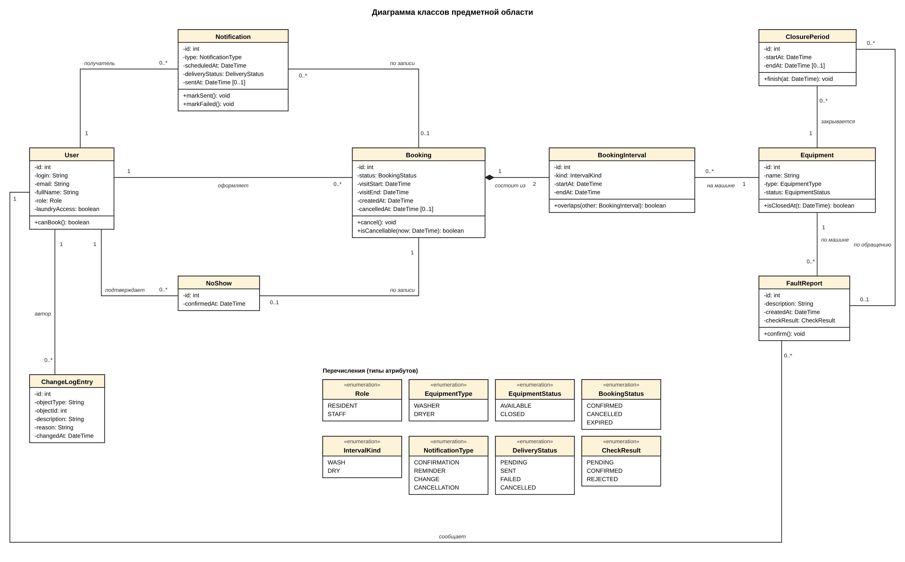
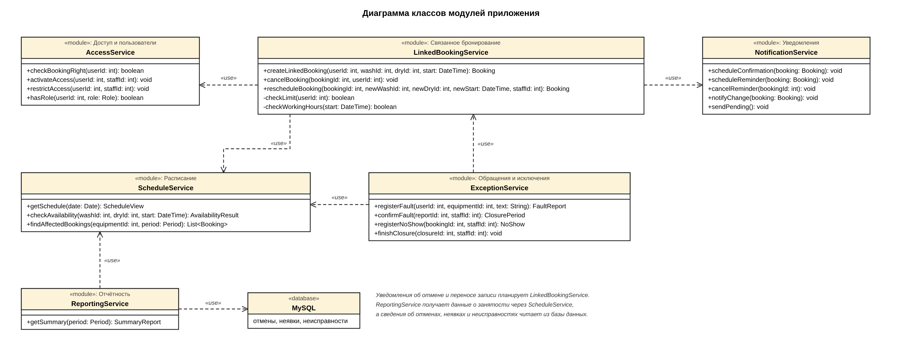
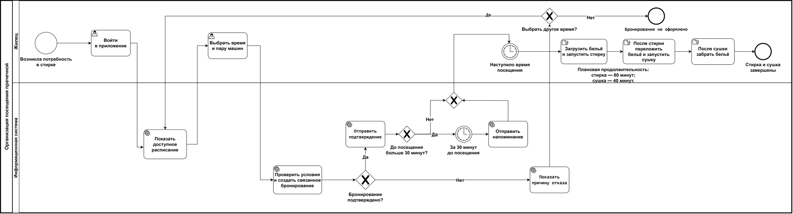

# Описание информационной системы с помощью UML, ERD и C4

**Практическая работа № 4**

**Дисциплина:** Проектирование информационных систем

**Тема:** Бронирование стиральных и сушильных машин в общежитии

## Состав команды и распределение работы

| Участник | Учебная группа | Основные задачи |
|---|---|---|
| Нгуен Динь Нам | K3340 | Требования и Use Case, Sequence AS-IS и TO-BE с их сравнением, уточнение BPMN, согласование моделей и оформление итогового отчёта |
| Субагио Сатрио Брахманторо Ади | K3340 | ERD, описание сущностей, связей и ограничений целостности, UML Class Diagram |
| Абакар Иссака Малли | K3341 | Архитектура C4, UML Component Diagram и State Diagram бронирования |

## Содержание

- [Цель и задачи работы](#цель-и-задачи-работы)
- [1. Диаграмма вариантов использования](#1-диаграмма-вариантов-использования)
- [2. Модель данных](#2-модель-данных)
- [3. Диаграммы последовательности](#3-диаграммы-последовательности)
- [4. Архитектура системы](#4-архитектура-системы)
- [5. Уточнение BPMN](#5-уточнение-bpmn)
- [6. Согласованность моделей и связь с требованиями](#6-согласованность-моделей-и-связь-с-требованиями)
- [7. Выводы](#7-выводы)
- [8. Список источников](#список-источников)

## Цель и задачи работы

**Цель работы** — описать функции, данные, взаимодействия и архитектуру системы бронирования стиральных и сушильных машин с помощью UML, ERD и C4, а затем уточнить BPMN с учётом принятых проектных решений.

В этой работе мы продолжаем вариант E, выбранный в работе № 2: адаптацию LibreBooking с модулем связанного бронирования. За основу берём требования R1–R16 и уточнённые бизнес-процессы из работы № 3.

Одно бронирование объединяет 80 минут стирки и следующие 40 минут сушки. Система проверяет условия записи, ведёт расписание и поддерживает обработку изменений. При этом жильцы самостоятельно пользуются машинами, ответственный сотрудник проверяет исключительные ситуации, а технический персонал ремонтирует оборудование.

Для достижения цели мы решаем следующие задачи:

1. Определяем действующих лиц и строим UML Use Case Diagram на основе требований из работы № 2.
2. Анализируем данные, разрабатываем ERD и описываем сущности, связи и ограничения целостности. Дополнительно строим UML Class Diagram.
3. Представляем оформление записи с помощью Sequence Diagram в состояниях AS-IS и TO-BE и сравниваем взаимодействия до и после внедрения системы. Дополнительно описываем жизненный цикл бронирования в State Diagram.
4. Показываем архитектуру с помощью C4 на уровнях контекста, контейнеров и компонентов. Дополняем её UML Component Diagram.
5. Анализируем BPMN из работы № 2 и уточняем её по результатам проектирования.
6. Проверяем согласованность названий, правил, состояний и ответственности компонентов между моделями, а также их связь с исходными требованиями.
7. Формулируем выводы и готовим подкаст с рефлексивным заключением.

## 1. Диаграмма вариантов использования

### 1.1. Назначение и границы системы

В этой части работы мы описываем взаимодействие пользователей с системой бронирования стиральных и сушильных машин в общежитии. За основу берём требования R1–R16 из работы № 2 и уточнённые процессы TO-BE из работы № 3.

Границу системы обозначаем как «ИС бронирования стиральных и сушильных машин». В неё включаем просмотр расписания, оформление и отмену связанных записей, управление правом пользования прачечной, обработку неявок и неисправностей, уведомления и предоставление сводных данных.

При этом одно бронирование объединяет 80 минут стирки и следующие за ними 40 минут сушки. Физическое использование и ремонт машин остаются за пределами информационной системы.

### 1.2. Действующие лица

В модели мы выделяем два действующих лица.

| Действующее лицо | Описание |
|---|---|
| Жилец | Просматривает расписание, оформляет и отменяет собственные записи, сообщает о неисправностях |
| Ответственный сотрудник | Управляет правом пользования прачечной, обрабатывает неявки и неисправности, просматривает сводные данные |

Под ответственным сотрудником понимаем коменданта или дежурного из предыдущих работ.

Технический персонал ремонтирует оборудование и сообщает результат сотруднику. Поскольку отдельный доступ к системе для него не предусматриваем, на диаграмме его не показываем.

*Рисунок 1 — Диаграмма вариантов использования системы бронирования стиральных и сушильных машин.*

### 1.3. Варианты использования

Для каждого действующего лица определяем доступные функции и результат их выполнения.

| Код | Название | Действующее лицо | Результат |
|---|---|---|---|
| UC1 | Просмотреть расписание | Жилец, Ответственный сотрудник | Показаны свободные, занятые и недоступные интервалы оборудования |
| UC2 | Оформить связанную запись | Жилец | Подтверждено бронирование стирки и сушки либо показана причина отказа |
| UC3 | Просмотреть свои записи | Жилец | Показаны собственные бронирования и их статусы |
| UC4 | Отменить свою запись | Жилец | Собственная запись отменена, связанные интервалы освобождены |
| UC5 | Сообщить о неисправности | Жилец | Обращение о неисправности зарегистрировано |
| UC6 | Управлять правом пользования прачечной | Ответственный сотрудник | Право пользователя на бронирование активировано или ограничено |
| UC7 | Обработать неявку | Ответственный сотрудник | Сохранён результат проверки; при необходимости освобождено неиспользованное время |
| UC8 | Обработать неисправность оборудования | Ответственный сотрудник | Обращение проверено, сведения о состоянии машины и периодах её закрытия обновлены |
| UC9 | Перенести или отменить затронутые записи | Ответственный сотрудник | Затронутые неисправностью бронирования перенесены или отменены |
| UC10 | Просмотреть сводные данные | Ответственный сотрудник | Показаны сведения о бронированиях, отменах, неявках и неисправностях |

### 1.4. Связи на диаграмме

Жильца связываем с вариантами использования UC1–UC5, а ответственного сотрудника — с UC1 и UC6–UC10.

Между UC9 «Перенести или отменить затронутые записи» и UC8 «Обработать неисправность оборудования» используем отношение `«extend»`. Стрелку направляем от UC9 к UC8. Расширение выполняется при наличии бронирований, затронутых недоступностью машины. Если таких записей нет, перенос или отмена не требуются.

Проверки полномочий, лимита записей, часов работы и доступности оборудования включаем в сценарий оформления бронирования. Отдельными вариантами использования их не выделяем, поскольку они являются внутренними шагами выполнения запроса.

Аналогично подтверждения и уведомления рассматриваем в составе соответствующих сценариев. Напоминания система отправляет автоматически по расписанию.

### 1.5. Основной сценарий UC2 «Оформить связанную запись»

В качестве основного сценария мы рассматриваем оформление связанной записи, поскольку оно объединяет проверку требований и резервирование обеих машин.

**Действующее лицо:** Жилец.

**Предусловие:** пользователь вошёл в систему.

**Основной сценарий:**

1. Жилец открывает расписание.
2. Система показывает доступность стиральных и сушильных машин.
3. Жилец выбирает время начала и пару машин, затем отправляет запрос.
4. Система проверяет действующее право пользования прачечной и лимит предстоящих записей.
5. Затем проверяет, что 80 минут стирки и следующие 40 минут сушки полностью входят в часы работы прачечной.
6. После этого проверяет доступность обеих машин в соответствующие интервалы, отсутствие пересечений с другими бронированиями и периодами закрытия.
7. Система сохраняет бронирование, оба интервала и задания уведомлений как единую операцию с защитой от конкурентных запросов. Напоминание планируется за 30 минут до начала, если до посещения остаётся больше 30 минут.
8. После успешного сохранения показывает подтверждение. Новая запись сразу учитывается в расписании.
9. После фиксации транзакции модуль «Уведомления» обрабатывает сохранённые задания в фоне.

**Альтернативные сценарии:**

- Если право пользования отсутствует или лимит записей достигнут, система отклоняет запрос и показывает причину.
- Если интервалы выходят за часы работы или одна из машин недоступна, жилец получает причину отказа. После этого он может изменить время или пару машин и повторить запрос.
- Если при сохранении обнаружен конфликт с другим запросом, бронирование не подтверждается, а частичные изменения отменяются.
- Если уведомление не удалось отправить, сохранённая запись остаётся действующей. Результат отправки фиксируется для повторной обработки.

**Постусловие успешного выполнения:** создано бронирование со статусом `CONFIRMED` и двумя связанными интервалами.

**Постусловие отказа:** подтверждённое бронирование не создано, время оборудования не занято этим запросом.

### 1.6. Правила остальных сценариев

#### Отмена собственной записи

Для UC4 мы предусматриваем проверку владельца, статуса бронирования и времени начала стирки. Жилец может отменить собственную подтверждённую запись до начала стирки.

При отмене бронирование получает статус `CANCELLED`, оба интервала перестают занимать время в расписании, а запланированное напоминание отменяется. При этом данные сохраняются для истории. Ситуации после начала посещения передаём ответственному сотруднику.

#### Управление правом пользования

В UC6 сотрудник проверяет проживание пользователя и активирует либо ограничивает его право на бронирование. Затем при каждом новом запросе система проверяет актуальное состояние этого права.

#### Обработка неявки

В UC7 сначала предусматриваем проверку фактической ситуации: сотрудник находит бронирование и выясняет, действительно ли жилец не пришёл. Если неявка не подтверждается, запись остаётся без изменений.

В противном случае сотрудник фиксирует неявку и отдельно проверяет фактическую доступность оборудования. Если оно занято, интервалы автоматически не освобождаются. Если оборудование свободно, освобождается только неиспользованное время.

После этого новая запись проходит полную проверку возможности выполнения цикла 80 + 40 минут.

#### Обработка неисправности

В UC5 жилец указывает машину и описывает проблему, после чего система сохраняет обращение для проверки сотрудником.

Далее в UC8 сотрудник проверяет сообщение. При подтверждённой неисправности закрывает машину для новых записей, а система определяет затронутые бронирования.

Если такие записи есть, выполняется UC9. Для посещения, которое ещё не началось, перенос или отмена охватывают всю пару интервалов. При переносе повторно проверяется доступность обеих машин. Если же посещение уже началось, сотрудник согласовывает дальнейшие действия с жильцом.

После подтверждения исправности техническим персоналом сотрудник завершает период закрытия машины. Доступность для новых записей снова определяется с учётом действующих бронирований и режима работы прачечной. Соответствующие изменения сопровождаются уведомлениями.

#### Просмотр сводных данных

В UC10 предоставляем сотруднику сведения о бронированиях, отменах, подтверждённых неявках и неисправностях.

Показатели занятости рассчитываем по данным расписания. При этом они отражают зарезервированное время, а не фактическую работу машин, поскольку показания оборудования система не получает.

### 1.7. Связь с требованиями

Чтобы проверить охват функций, сопоставляем варианты использования с исходными требованиями.

| Требования | Отражение в модели |
|---|---|
| R1 | UC1: просмотр актуального расписания |
| R2 | UC2–UC4: оформление, просмотр и отмена собственных записей |
| R6 | Подтверждения и напоминания в сценарии UC2 |
| R7 | Проверка пересечений и защита от конкурентных запросов в UC2 и UC9 |
| R8 | UC5, UC8, UC9: сообщения о неисправностях и обработка затронутых записей |
| R9 | UC10: просмотр сводных данных |
| R10 | UC6 и проверка права пользования в UC2 |
| R11 | Проверка лимита предстоящих записей в UC2 |
| R12 | UC7: проверка и обработка неявки |
| R13 | Разграничение доступа по ролям и работа жильца только с собственными записями |
| R14 | Проверка связанных интервалов 80 + 40 минут в UC2 и при переносе в UC9 |

Требования R3–R5, R15 и R16 учитываем при проектировании интерфейса, архитектуры и развёртывания, а также при оценке стоимости и сроков. В отдельные варианты использования их не выделяем.

## 2. Модель данных и классы

### 2.1. Назначение и исходные данные

В этой части работы мы описываем данные информационной системы бронирования стиральных и сушильных машин в виде ERD и диаграммы классов UML. За основу берём требования R1–R16 из работы № 2, процессы TO-BE из работы № 3 и документ «Общие проектные решения».

Модель рассчитана на одну прачечную общежития примерно на 500 жильцов с 10 стиральными и 10 сушильными машинами. Одно подтверждённое бронирование содержит ровно два интервала: 80 минут стирки и следующие за ними 40 минут сушки.

Мы описываем проектную модель данных. Сопоставление с LibreBooking приведено отдельно в разделе 2.8.

### 2.2. Сущности и атрибуты

| Сущность | Назначение | Основные атрибуты |
|---|---|---|
| Пользователь (`User`) | Учётная запись жильца или ответственного сотрудника | `user_id`, `login`, `email`, `full_name`, `role`, `laundry_access`, `created_at` |
| Оборудование (`Equipment`) | Стиральная или сушильная машина | `equipment_id`, `name`, `type`, `status` |
| Бронирование (`Booking`) | Связанная запись на стирку и сушку | `booking_id`, `user_id`, `status`, `visit_start`, `visit_end`, `created_at`, `cancelled_at` |
| Интервал бронирования (`BookingInterval`) | Время занятости одной машины в рамках бронирования | `interval_id`, `booking_id`, `equipment_id`, `kind`, `start_at`, `end_at` |
| Обращение о неисправности (`FaultReport`) | Сообщение жильца о проблеме с машиной и результат проверки | `report_id`, `equipment_id`, `reporter_id`, `description`, `created_at`, `check_result` |
| Период закрытия оборудования (`ClosurePeriod`) | Время, когда машина недоступна для новых записей | `closure_id`, `equipment_id`, `report_id`, `start_at`, `end_at` |
| Неявка (`NoShow`) | Подтверждённая сотрудником неявка жильца | `noshow_id`, `booking_id`, `staff_id`, `confirmed_at` |
| Уведомление (`Notification`) | Подтверждение, напоминание или сообщение об изменении | `notification_id`, `user_id`, `booking_id`, `type`, `scheduled_at`, `delivery_status`, `sent_at` |
| История изменений (`ChangeLog`) | Журнал изменений с автором, временем и причиной | `log_id`, `author_id`, `object_type`, `object_id`, `change_description`, `reason`, `changed_at` |

Для перечислимых атрибутов используем следующие значения.

| Атрибут | Значения |
|---|---|
| `User.role` | `RESIDENT`, `STAFF` |
| `Equipment.type` | `WASHER`, `DRYER` |
| `Equipment.status` | `AVAILABLE`, `CLOSED` |
| `Booking.status` | `CONFIRMED`, `CANCELLED`, `EXPIRED` |
| `BookingInterval.kind` | `WASH`, `DRY` |
| `FaultReport.check_result` | `PENDING`, `CONFIRMED`, `REJECTED` |
| `Notification.type` | `CONFIRMATION`, `REMINDER`, `CHANGE`, `CANCELLATION` |
| `Notification.delivery_status` | `PENDING`, `SENT`, `FAILED`, `CANCELLED` |

Адрес `email` используем для отправки уведомлений жильцу.

Статус `EXPIRED` отражает окончание запланированного времени по расписанию, а не фактическое освобождение машины. Отменённые бронирования сохраняем для истории, но не учитываем при расчёте занятого времени.

### 2.3. Связи

| Связь | Кратность | Пояснение |
|---|---|---|
| Пользователь — Бронирование | 1 : 0..N | Жилец оформляет собственные бронирования |
| Бронирование — Интервал бронирования | 1 : 2 | Каждое бронирование содержит интервал стирки и интервал сушки |
| Оборудование — Интервал бронирования | 1 : 0..N | Каждый интервал относится к одной машине |
| Оборудование — Период закрытия | 1 : 0..N | Машина может закрываться несколько раз |
| Оборудование — Обращение о неисправности | 1 : 0..N | Обращение относится к одной машине |
| Пользователь — Обращение о неисправности | 1 : 0..N | Жилец сообщает о неисправности |
| Обращение о неисправности — Период закрытия | 0..1 : 0..N | Период закрытия может быть связан с подтверждённым обращением |
| Бронирование — Неявка | 1 : 0..1 | Для бронирования фиксируется не более одной неявки |
| Пользователь — Неявка | 1 : 0..N | Неявку подтверждает ответственный сотрудник |
| Пользователь — Уведомление | 1 : 0..N | Получатель уведомления |
| Бронирование — Уведомление | 0..1 : 0..N | Уведомление может относиться к бронированию |
| Пользователь — История изменений | 1 : 0..N | Автор изменения |

В `ChangeLog` объект изменения задаём парой `object_type` и `object_id`. Так журнал охватывает разные сущности без отдельной связи с каждой из них.

### 2.4. Ограничения целостности

Часть правил нельзя выразить связями ERD, поэтому описываем их отдельно.

- Подтверждённое бронирование содержит один интервал `WASH` на стиральной машине длительностью 80 минут и один интервал `DRY` на сушильной машине длительностью 40 минут.
- Интервал `DRY` начинается сразу после окончания интервала `WASH`. Перерыва между ними нет.
- Интервалы одной машины в подтверждённых бронированиях не пересекаются между собой и с периодами закрытия.
- Бронирование и оба интервала сохраняем одной транзакцией. При ошибке частичные изменения отменяем.
- Режим работы прачечной и лимит предстоящих записей считаем параметрами настройки, а не сущностями модели.
- Сбой отправки уведомления не отменяет бронирование: результат отправки сохраняем в `delivery_status` для повторной обработки.
- При отмене бронирования неотправленное напоминание отменяем и переводим в статус `CANCELLED`. Перед отправкой система повторно проверяет актуальность задания: статус бронирования и время посещения.

### 2.5. Диаграмма ERD

*Рисунок 2 — ERD системы бронирования стиральных и сушильных машин.*

Центральной сущностью является «Бронирование». Оно связано с жильцом, двумя интервалами, возможной неявкой и уведомлениями. Интервалы привязаны к оборудованию, поэтому занятость машин определяется по подтверждённым интервалам и периодам закрытия.

Обращения о неисправностях и периоды закрытия образуют отдельную ветвь вокруг сущности «Оборудование». Подтверждённое обращение приводит к закрытию машины, после чего система определяет затронутые бронирования по пересечению их интервалов с периодом закрытия.

### 2.6. Диаграмма классов предметной области

*Рисунок 3 — Диаграмма классов предметной области.*

Классы предметной области соответствуют сущностям ERD. Связь «Бронирование — Интервал бронирования» показываем как композицию: интервалы не существуют отдельно от бронирования, и в каждом бронировании их ровно два.

Операции классов отражают правила проекта. Например, `Booking.isCancellable()` проверяет, что запись можно отменить до начала стирки, а `BookingInterval.overlaps()` используется при проверке пересечений. Атрибуты `cancelledAt`, `sentAt` и `endAt` могут отсутствовать, поэтому отмечаем их кратностью `[0..1]` в соответствии с `NULL` в ERD. Перечисления показываем отдельно, так как они задают типы атрибутов.

### 2.7. Диаграмма классов модулей

*Рисунок 4 — Диаграмма классов модулей приложения.*

Для шести логических модулей из документа «Общие проектные решения» выделяем по одному классу. Модуль «Связанное бронирование» использует «Доступ и пользователи» для проверки права, «Расписание» для проверки доступности и «Уведомления» для подтверждений и напоминаний. Уведомления об отмене и переносе записи планирует именно он.

Модуль «Обращения и исключения» обрабатывает неисправности и неявки. Для переноса или отмены затронутых записей он обращается к модулю «Связанное бронирование», а для поиска таких записей — к модулю «Расписание». Напрямую к модулю «Уведомления» он не обращается: уведомление планирует «Связанное бронирование» при отмене или переносе записи. Для переноса сотрудник указывает обе машины, новое время начала и свой идентификатор.

Модуль «Отчётность» получает данные о занятости через «Расписание», а сведения об отменах, неявках и неисправностях читает из базы данных.

### 2.8. Сопоставление с LibreBooking

LibreBooking создан на основе Booked Scheduler, поэтому для сопоставления опираемся на структуру таблиц Booked Scheduler. Имена таблиц и полей уточняем по установленной версии LibreBooking.

| Данные проекта | Структура LibreBooking | Оценка |
|---|---|---|
| Пользователь | `users`, `user_groups`, `user_statuses` | Есть. Право пользования и роль сотрудника задаём через статус и группу пользователя |
| Оборудование | `resources`, типы и статусы ресурсов | Есть. Тип `WASHER` или `DRYER` задаём типом ресурса или настраиваемым атрибутом |
| Бронирование | `reservation_series`, `reservation_statuses` | Частично. Набор статусов проекта нужно согласовать со статусами системы |
| Интервал бронирования | `reservation_instances`, `reservation_resources` | Расширение. Одна запись LibreBooking занимает выбранные ресурсы на общий интервал, а связанная запись требует двух последовательных интервалов на разных машинах |
| Период закрытия | `blackout_series`, `blackout_instances` | Есть |
| Лимит записей | `quotas` | Есть |
| Уведомление | `reminders`, `reservation_reminders`, настройки email | Частично. Фиксацию результата отправки и повторную обработку добавляем расширением |
| Неявка | Отметки прихода и ухода в настройках ресурса | Частично. Подтверждение неявки сотрудником добавляем расширением |
| Обращение о неисправности | Не выявлено | Расширение |
| История изменений | Не выявлено | Расширение |

Расширения реализуем в модуле связанного бронирования и в дополнительных таблицах. Данные LibreBooking при этом не заменяем: расширения ссылаются на пользователей, ресурсы и бронирования исходной системы.

## 3. Диаграммы последовательности

### 3.1. Выбор процесса

Для сравнения AS-IS и TO-BE мы рассматриваем оформление записи на посещение прачечной. Этот процесс позволяет показать, как меняются проверка доступности, обмен сообщениями и сохранение результата после внедрения системы.

В AS-IS жилец выбирает время по переписке и публикует запись на стирку в общем чате. В TO-BE он отправляет запрос через систему, которая проверяет условия и сохраняет связанную запись на стирку и сушку.

В обеих моделях ограничиваем сценарий оформлением записи. Физическое использование оборудования рассматриваем в бизнес-процессах из работы № 3.

### 3.2. Оформление записи — AS-IS

В диаграмме AS-IS используем две линии жизни: «Жилец» и «Общий чат». Ответственного сотрудника не включаем, поскольку при обычном оформлении записи жилец самостоятельно выбирает время и публикует сообщение.

Сначала жилец открывает переписку и просматривает сообщения о записях, отменах и изменениях. Затем сопоставляет сведения и выбирает время стирки. После отправки сообщения чат сохраняет и отображает запись, которая становится доступна другим жильцам.

*Рисунок 2 — Диаграмма последовательности оформления записи на стирку в модели AS-IS.*

На диаграмме мы разделяем действия жильца и функции чата. Жилец самостоятельно оценивает занятость по сообщениям, а чат обеспечивает их сохранение и отображение.

При этом публикация сообщения не означает автоматической проверки или подтверждения доступности машины. Два жильца могут выбрать одинаковое время, если ориентируются на одну и ту же переписку до появления новых сообщений. Кроме того, время сушки заранее не резервируется.

Поэтому результатом сценария считаем опубликованную запись на стирку, а не подтверждённое системой бронирование двух машин.

### 3.3. Оформление связанной записи — TO-BE

В модели TO-BE мы показываем взаимодействие жильца с модулями «Расписание», «Связанное бронирование», «Доступ и пользователи» и базой данных MySQL. Для удобства чтения представляем процесс двумя связанными диаграммами: общий сценарий и подробную проверку с сохранением записи.

Сначала жилец открывает расписание, выбирает время начала и пару машин, затем отправляет запрос. Фрагмент `ref` на общей диаграмме обозначает взаимодействие «Проверка и сохранение бронирования», которое раскрываем на следующем рисунке.

*Рисунок 3 — Общая диаграмма последовательности оформления связанной записи в модели TO-BE.*

После обработки запроса жилец получает подтверждение, причину отказа или сообщение о технической ошибке. При этом показанные свободные интервалы служат для выбора времени: перед сохранением система повторно проверяет актуальные условия, поскольку могли поступить другие запросы.

Далее раскрываем проверку и сохранение в рамках одной транзакции. Сначала получаем блокировки пользователя и выбранных машин, затем проверяем право бронирования, лимит предстоящих записей и соответствие полного цикла часам работы прачечной. После этого модуль «Расписание» проверяет доступность стиральной машины на 80 минут и сушильной на следующие 40 минут.

*Рисунок 4 — Проверка и сохранение связанного бронирования в одной транзакции.*

Фрагменты `break` показывают досрочное завершение обработки. Если условия не выполнены или сохранение завершается ошибкой, транзакция откатывается. Поэтому отдельно сохранённый интервал стирки или сушки не остаётся.

При успешной проверке сохраняем бронирование со статусом `CONFIRMED`, два связанных интервала, историю изменений и задания уведомлений. Подтверждение выдаём только после успешной фиксации транзакции. С этого момента оба интервала учитываются в расписании.

Для защиты от конкурентных запросов предусматриваем согласованный порядок блокировок при создании, отмене и переносе записей, изменении права доступа и закрытии оборудования. Проверки внутри транзакции выполняем по актуальным данным после получения блокировок. Эти механизмы рассматриваем как проектное решение для расширения LibreBooking.

Модуль «Уведомления» обрабатывает сохранённые задания в фоне после фиксации транзакции. Сбой почтового сервиса не отменяет бронирование: результат отправки фиксируется для повторной обработки. Напоминание планируем за 30 минут до посещения, если при оформлении до начала остаётся больше 30 минут. При более позднем бронировании достаточно подтверждения.

### 3.4. Сравнение AS-IS и TO-BE

Сопоставляя диаграммы, мы рассматриваем, кто проверяет доступность, как сохраняется запись и какой результат получает жилец.

| Аспект | AS-IS | TO-BE |
|---|---|---|
| Источник сведений | Сообщения в общем чате | Бронирования и периоды закрытия в базе данных |
| Проверка доступности | Жилец самостоятельно сопоставляет сообщения | Система проверяет оба интервала перед сохранением |
| Состав записи | Заранее указывается время стирки; сушка не резервируется | Одна запись объединяет 80 минут стирки и следующие 40 минут сушки |
| Право пользования и лимит | Автоматическая проверка в рассматриваемом сценарии отсутствует | Проверяются при каждом запросе |
| Одновременные запросы | Возможны записи на одинаковое время | Проверка и сохранение защищены транзакцией и согласованными блокировками |
| Результат | Сообщение о записи опубликовано | Бронирование подтверждено после сохранения либо показана причина отказа или ошибки |
| Ошибка сохранения | Согласованное сохранение пары интервалов не предусмотрено | Частичные изменения откатываются |
| Уведомления | Жильцы самостоятельно читают переписку | Подтверждения и напоминания обрабатываются модулем уведомлений |

В TO-BE мы переносим проверку доступности от жильца к системе и обеспечиваем согласованное сохранение двух интервалов. При этом расписание отражает резервирование оборудования. Фактическое присутствие жильца и освобождение машины по-прежнему проверяет сотрудник при обработке исключений.

### 3.5. Диаграмма состояний бронирования

Жизненный цикл бронирования показываем в UML State Diagram. Диаграмма использует три статуса из общих проектных решений: `CONFIRMED`, `CANCELLED` и `EXPIRED`.

*Рисунок 5 — Диаграмма состояний бронирования.*

Бронирование появляется сразу в состоянии `CONFIRMED`. Это происходит после проверки права пользования, лимита предстоящих записей, часов работы и доступности обеих машин, а также после сохранения записи и двух интервалов в одной транзакции. Отклонённый запрос бронирования не создаёт, поэтому отдельного состояния для него нет: жилец получает причину отказа.

Из состояния `CONFIRMED` возможны следующие переходы:

| Событие | Условие | Результат |
|---|---|---|
| Жилец отменяет свою запись | Запись принадлежит жильцу, стирка ещё не началась | Статус `CANCELLED`, оба интервала освобождены, напоминание отменено |
| Сотрудник отменяет затронутую запись | Посещение ещё не началось | Статус `CANCELLED`, оба интервала освобождены, запланированное напоминание отменено, жилец получает уведомление |
| Сотрудник переносит затронутую запись | Посещение ещё не началось | Статус остаётся `CONFIRMED`; обе машины проверяются повторно, пара интервалов заменяется, напоминание обновляется, планируется уведомление о переносе. Замена интервалов и обновление заданий уведомлений выполняются в одной транзакции |
| Сотрудник подтверждает неявку и отменяет неиспользованную запись | Неявка подтверждена, оборудование фактически свободно, время посещения ещё не истекло | Статус `CANCELLED`; освобождается только неиспользованное время, напоминание отменяется |
| Истекло запланированное время посещения | — | Статус `EXPIRED` |

`CANCELLED` и `EXPIRED` являются конечными состояниями. Отменённые записи сохраняются для истории, но не занимают время в расписании. Статус `EXPIRED` показывает окончание времени по расписанию, а не фактическое освобождение машины.

Неявку отдельным статусом не показываем: статус `NO_SHOW` не используется, а сама неявка хранится как отдельный объект. Если оборудование занято, неявку можно подтвердить без освобождения интервалов, и статус остаётся `CONFIRMED`. Ситуации после начала посещения обрабатывает ответственный сотрудник, поэтому автоматических переходов для них нет.

## 4. Архитектура системы

### 4.1. Контекст системы — C4, уровень 1

На уровне контекста показываем систему как единое целое, её пользователей и внешние системы.

*Рисунок 6 — Контекст системы бронирования стиральных и сушильных машин (C4, уровень 1).*

| Элемент | Роль |
|---|---|
| Жилец | Просматривает расписание, оформляет и отменяет собственные записи, сообщает о неисправности. Работает через браузер телефона |
| Ответственный сотрудник | Комендант или дежурный. Управляет правом пользования, обрабатывает неявки и неисправности, просматривает сводные данные |
| Технический персонал | Проверяет и ремонтирует машины. Доступа к системе не имеет и сообщает результат сотруднику |
| ИС бронирования стиральных и сушильных машин | Расписание, связанная запись на 80 + 40 минут, обработка исключений, уведомления. Основа — LibreBooking с модулем связанного бронирования |
| Почтовый сервис | Внешняя система, которая доставляет подтверждения, напоминания и сообщения об изменениях |

Технический персонал показан как внешний участник, связанный только с сотрудником, а не с системой: это соответствует принятому решению не предоставлять ему отдельный доступ. Физическое использование машин, загрузка белья и ремонт остаются за границей системы. Управление оборудованием, датчики и платежи в проект не входят.

### 4.2. Контейнеры — C4, уровень 2

На втором уровне раскрываем систему на отдельно развёртываемые части и показываем границу размещения данных.

*Рисунок 7 — Контейнеры системы (C4, уровень 2).*

| Контейнер | Технология | Назначение |
|---|---|---|
| Веб-приложение | LibreBooking (PHP) и модуль связанного бронирования | Веб-интерфейс для жильцов и сотрудника, логика всех модулей, фоновая обработка заданий уведомлений |
| База данных | MySQL | Пользователи и роли, оборудование, бронирования и интервалы, обращения, периоды закрытия, неявки, задания уведомлений, история изменений |
| Резервные копии | Хранилище копий базы данных | Регулярные копии персональных данных |

Жильцы и сотрудник работают с приложением через браузер по HTTPS, отдельного мобильного приложения нет. Приложение читает и записывает данные в MySQL. Бронирование и оба интервала сохраняются в одной транзакции. Сообщения приложение передаёт почтовому сервису по SMTP.

Приложение, база данных и резервные копии находятся на серверах на территории РФ. Эта граница показана на диаграмме пунктиром. Фоновую обработку уведомлений не выделяем в отдельный контейнер: она выполняется приложением и относится к модулю «Уведомления».

### 4.3. Компоненты приложения — C4, уровень 3

На третьем уровне показываем внутреннее устройство веб-приложения. Шесть логических модулей из общих проектных решений дополняем веб-интерфейсом, через который к ним обращаются пользователи.

*Рисунок 8 — Компоненты веб-приложения (C4, уровень 3).*

| Компонент | Ответственность |
|---|---|
| Веб-интерфейс | Страницы расписания, записи, обращений и сводных данных; передаёт запросы модулям |
| Доступ и пользователи | Учётные записи, роли, право пользования прачечной, проверка полномочий |
| Связанное бронирование | Проверка условий; создание, отмена и перенос пары интервалов 80 + 40 минут в одной транзакции |
| Расписание | Предоставление доступности на основе бронирований и периодов закрытия |
| Обращения и исключения | Неисправности, неявки, закрытие машин, решения сотрудника |
| Уведомления | Подтверждения, напоминания за 30 минут, сообщения об изменениях, повторная отправка при сбое |
| Отчётность | Сводные данные о записях, отменах, неявках и неисправностях |

Основные зависимости такие:

- «Связанное бронирование» проверяет право пользования через «Доступ и пользователи» и доступность обеих машин через «Расписание». Задания уведомлений оно планирует в той же транзакции, в которой сохраняет запись.
- «Обращения и исключения» определяют затронутые записи с помощью «Расписания», а перенос и отмену выполняют через «Связанное бронирование». Поэтому правила пары интервалов применяются одинаково при записи, отмене и переносе.
- «Уведомления» читают сохранённые задания из базы данных, отправляют сообщения почтовому сервису и записывают результат отправки. Сбой почты не отменяет бронирование.
- «Отчётность» берёт данные о занятости из «Расписания», а сведения об отменах, неявках и неисправностях читает из базы данных.

Компоненты рассматриваем как логические модули одного приложения, а не как отдельные сервисы. Общая база данных сама по себе не предотвращает пересечения при одновременных запросах. Поэтому при создании, отмене и переносе записи модуль «Связанное бронирование» получает блокировки пользователя и выбранных машин, повторно проверяет актуальные данные после их получения и сохраняет оба интервала в той же транзакции (рисунок 4). Подтверждённые бронирования сразу учитываются при проверке новых запросов.

В расчёте принимаем LibreBooking версии 7.2.0 (выпуск от 3 ноября 2026 г.). Для неё требуются PHP 8.2 или новее, MySQL 8.0 или новее либо MariaDB 10.6 или новее [1], [2].

Функции распределяем по трём группам:

- **используем без изменений** — возможности, которые платформа заявляет штатными: расписание ресурсов, ролевое разграничение доступа, квоты и отчёты об использовании [1];
- **адаптируем настройкой** — перечень из 10 стиральных и 10 сушильных машин как ресурсов, часы работы, ограничение числа предстоящих записей через квоты, закрытие машин, уведомления;
- **реализуем дополнительно** — связанную запись на 80 + 40 минут в одной транзакции с блокировками, проверку права проживания, определение затронутых записей с переносом или отменой пары интервалов, фиксацию неявок, задания уведомлений с повторной отправкой при сбое.

Возможности версии 7.2.0 подтверждаем при установке и в приёмочных испытаниях.

Источники к разделу 4.3:

1. [LibreBooking: README проекта](https://github.com/LibreBooking/librebooking).
2. [LibreBooking: журнал изменений](https://librebooking.readthedocs.io/en/latest/changelog.html).

### 4.4. Диаграмма компонентов UML

UML Component Diagram описывает ту же архитектуру, что и C4, но показывает интерфейсы, которые модули предоставляют и требуют друг от друга.

*Рисунок 9 — Диаграмма компонентов UML.*

| Интерфейс | Предоставляет | Основные операции |
|---|---|---|
| IПолномочия | Доступ и пользователи | Проверить вход, проверить роль, проверить право пользования |
| IРасписание | Расписание | Получить расписание, проверить доступность, найти затронутые записи |
| IСвязаннаяЗапись | Связанное бронирование | Создать, отменить, перенести |
| IИсключения | Обращения и исключения | Зарегистрировать неисправность, закрыть машину, зафиксировать неявку |
| IПланированиеУведомлений | Уведомления | Запланировать, отменить |
| IСводныеДанные | Отчётность | Получить отчёт |

«Веб-интерфейс» зависит от интерфейсов модулей и не обращается к базе данных напрямую. Все модули обращаются к MySQL через интерфейс SQL, а «Уведомления» дополнительно используют интерфейс SMTP почтового сервиса.

Зависимости между модулями односторонние: «Связанное бронирование» и «Обращения и исключения» используют «Расписание», а «Расписание» не обращается к модулям, которые его вызывают. Благодаря этому циклических зависимостей между модулями нет. Стрелки показывают только, какой модуль использует интерфейс другого, и не задают порядок действий. Порядок обработки неисправности такой: сначала «Обращения и исключения» получают затронутые записи через «Расписание», затем вызывают перенос или отмену через «Связанное бронирование».

### 4.5. Учёт нефункциональных требований и ограничений

Нефункциональные требования и ограничения из работы № 2 учитываем в архитектуре следующим образом.

| Требование | Как учтено в архитектуре |
|---|---|
| R3. Доступ через браузер мобильного телефона | Единственный канал доступа — веб-интерфейс по HTTPS, отдельное приложение не требуется |
| R4. Данные и резервные копии на серверах РФ | Приложение, база данных и резервные копии размещены в границе «Серверы на территории РФ» (рисунок 7) |
| R5. Не менее 95 % операций за 2 с при 50 пользователях | Проверка и сохранение записи выполняются одной короткой транзакцией. Отправка уведомлений вынесена в фон и не задерживает ответ жильцу. Показатель проверяется в приёмочных испытаниях |
| R7. Нет пересекающихся записей, в том числе при одновременных запросах | Модуль «Связанное бронирование» получает блокировки и проверяет условия по актуальным данным внутри транзакции |
| R13. Жилец работает только со своими записями | Роли и полномочия проверяет модуль «Доступ и пользователи»; другим жильцам персональные данные не показываются |
| R15. Затраты на создание не более 600 тыс. руб. | Используется готовая платформа LibreBooking с доработкой, а не разработка с нуля. Оценка создания — 345 тыс. руб. |
| R16. Ввод в эксплуатацию не позднее 12 месяцев | Планируемый срок внедрения — 5 месяцев |

Основные ограничения архитектуры:

- Система не получает показания оборудования, поэтому показатели занятости отражают зарезервированное время, а не фактическую работу машин.
- Лимит предстоящих записей задаётся параметром настройки, потому что в исходных требованиях конкретного значения нет.
- Модули не выделяются в отдельные сервисы: для одной прачечной примерно на 500 жильцов, 10 стиральных и 10 сушильных машин это упрощает развёртывание и сопровождение.
- Обновление LibreBooking может повлиять на дополнительный модуль, поэтому обновления проверяются в тестовой среде, как предусмотрено оценкой рисков в работе № 2.

## 5. Уточнение BPMN

В этой части мы уточняем BPMN процесса «Организация посещения прачечной» из работы № 2 с учётом результатов проектирования в работе № 4. При этом сохраняем правила связанного бронирования и физические действия жильца, описанные в работе № 3.

Основные изменения касаются сохранения бронирования, подтверждения результата и отправки уведомлений. Проверку условий и сохранение связанных интервалов рассматриваем как единую операцию. Подтверждение показываем только после успешной фиксации данных.

*Уточнённая BPMN процесса «Организация посещения прачечной».*

После отправки запроса система проверяет право пользования, лимит предстоящих записей, часы работы и доступность обеих машин. При выполнении условий сохраняются 80 минут стирки и следующие 40 минут сушки. Проверка и сохранение защищены от конкурентных запросов; при ошибке частичные изменения отменяются.

Далее шлюз «Бронирование сохранено?» разделяет успешное оформление и отказ либо техническую ошибку. В первом случае жилец получает подтверждение и ожидает времени посещения. Во втором — видит причину и решает, повторить ли выбор времени или завершить попытку.

Задания уведомлений сохраняются вместе с бронированием, а отправка выполняется в фоне. Поэтому ожидание напоминания больше не входит в основной поток процесса. При этом правило сохраняется: напоминание отправляется за 30 минут до посещения, если запись оформлена раньше этого срока. Сбой отправки не отменяет бронирование.

В таблице приводим изменения и их связь с результатами проектирования.

| Изменение BPMN | Причина и связь с моделями |
|---|---|
| Уточнена задача проверки и сохранения связанного бронирования | В Sequence Diagram проверка и сохранение обоих интервалов объединены одной транзакцией |
| Шлюз сформулирован как «Бронирование сохранено?» | Успех определяется сохранением всей записи, а не только предварительной проверкой доступности |
| Подтверждение показывается после сохранения | Соответствует успешному завершению UC2 и созданию бронирования со статусом `CONFIRMED` |
| В отрицательной ветви учитываются отказ и техническая ошибка | Соответствует альтернативным сценариям UC2 и ветвям завершения в Sequence Diagram |
| Отправка уведомлений вынесена в фоновую обработку | Соответствует ответственности модуля «Уведомления»; ошибка отправки не влияет на сохранённую запись |

Действия жильца после наступления времени посещения сохраняем: загрузить бельё и запустить стирку, перенести вещи в сушильную машину, затем забрать их. Система организует запись и предоставляет расписание, а оборудование запускает и освобождает сам жилец.
## 6. Согласованность моделей и связь с требованиями

## 7. Выводы

## 8. Список источников
